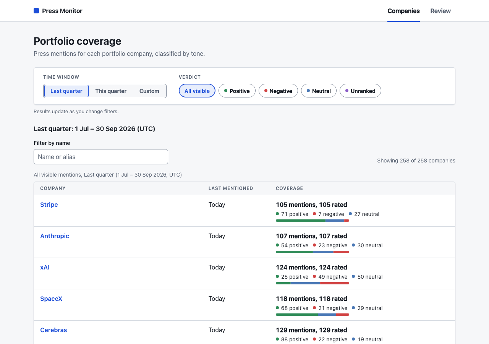
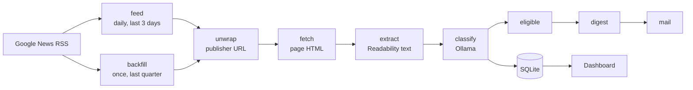
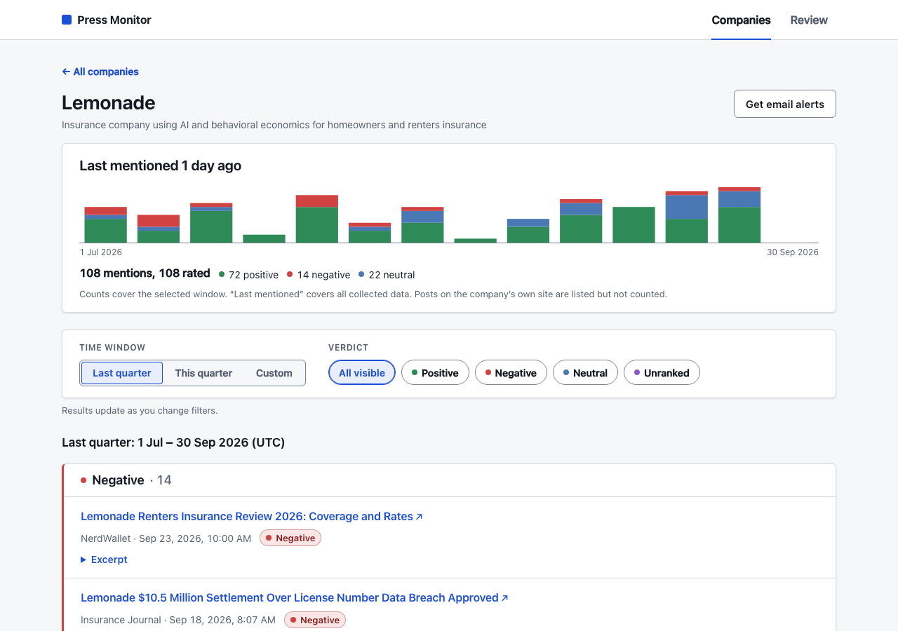
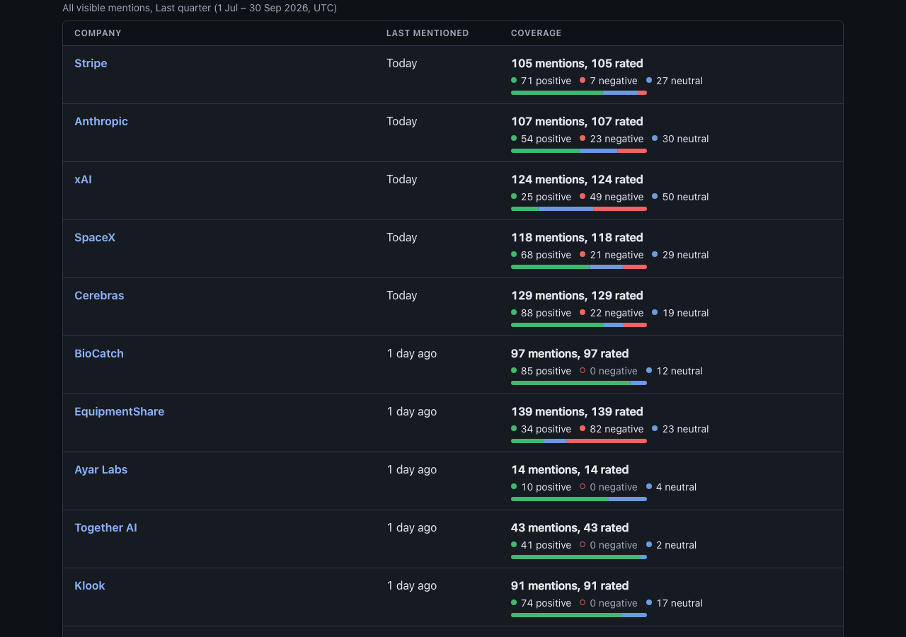
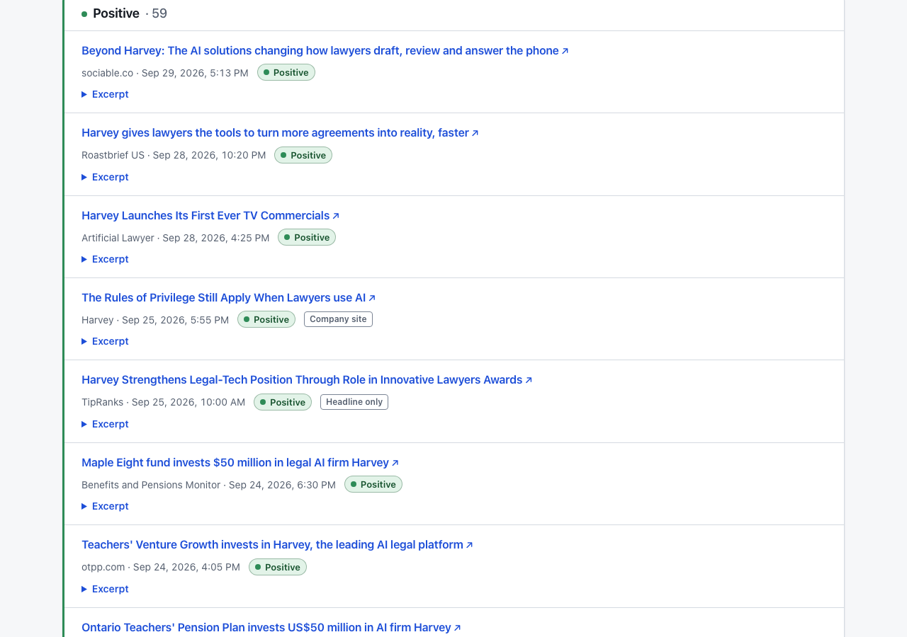
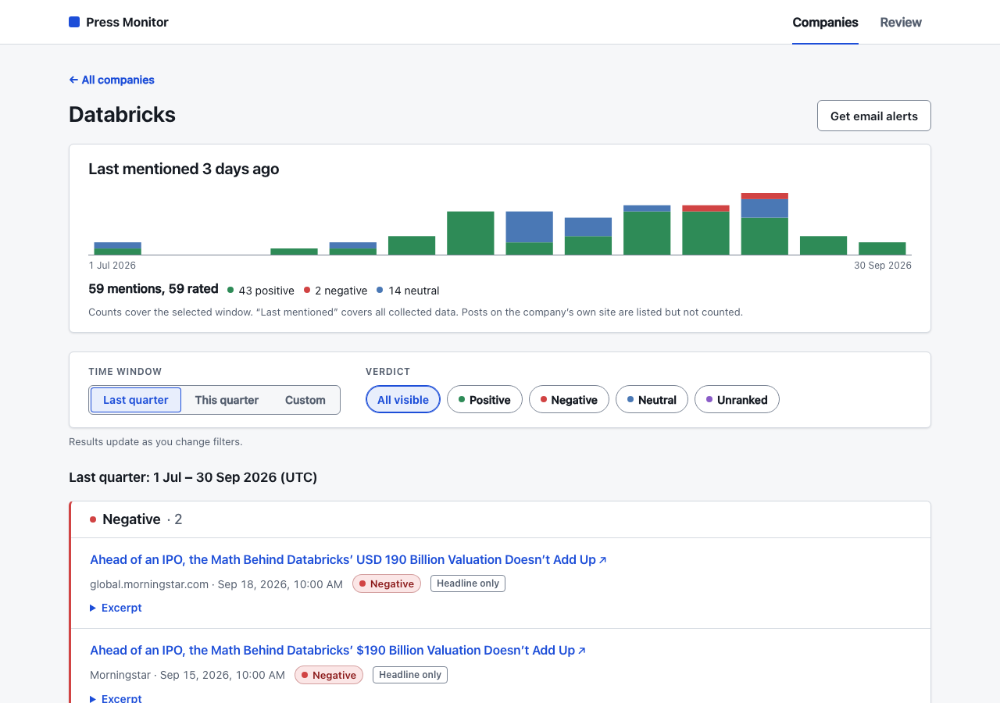
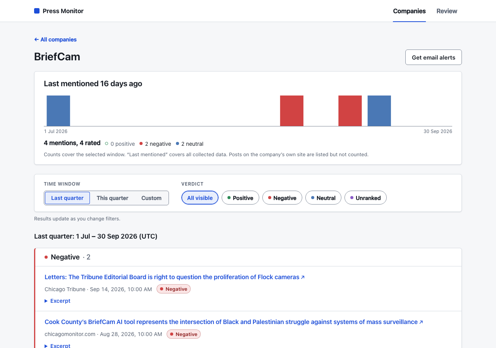
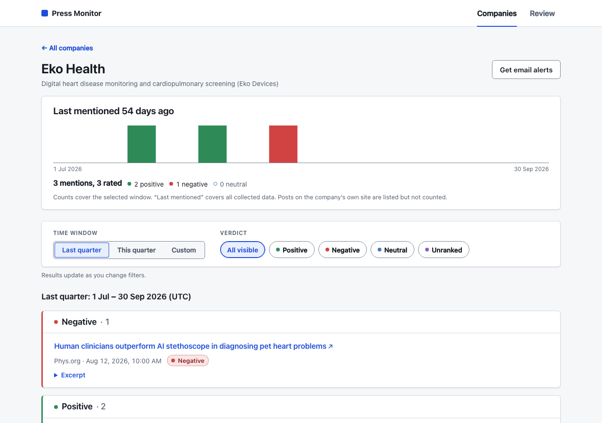
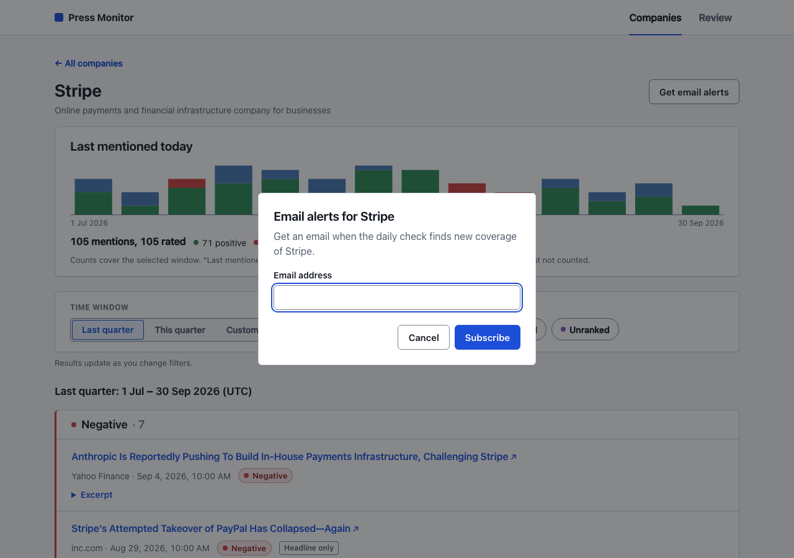
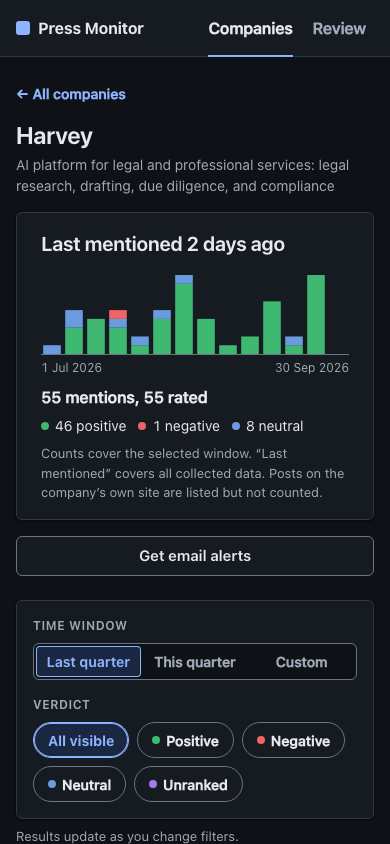

# Press Mentions Monitor

**Tracks press coverage for OurCrowd's 258 portfolio and fund companies.** It collects news, judges each article with a **local Ollama model**, shows the quarter on a dashboard, and a daily job alerts when new coverage appears.



## The three goals

| Goal                                                                                      | Where it lives                                                                                                                                                                     |
| ----------------------------------------------------------------------------------------- | ---------------------------------------------------------------------------------------------------------------------------------------------------------------------------------- |
| **Quarterly dashboard**: each mention positive / negative / neutral, linked to its source | `npm start`, then open http://127.0.0.1:3000. The index tallies every company with a tone bar; each company page charts the quarter week by week and lists its mentions with links |
| **Mention status**: "last mentioned 3 days ago / no coverage"                             | The index's _Last mentioned_ column, the company page header, and `data/summary.json`                                                                                              |
| **Daily alert** when new coverage appears                                                 | `job:feed` → … → `job:digest` → `job:mail`, from the crontab below. The 4 Oct run sent 45 digests                                                                                  |

## The real run (as of 2026-10-04)

| Q3 2026 (1 Jul – 30 Sep, UTC) |                                                                                                                                     |
| ----------------------------- | ----------------------------------------------------------------------------------------------------------------------------------- |
| Companies tracked             | 258. 153 with Q3 coverage, 105 with none found                                                                                      |
| Mentions shown                | **3,058** listed. **2,798** counted: 1,794 positive · 680 neutral · 312 negative · 12 unranked                                      |
| Company's own site            | 260 posts from 15 companies' own sites (Databricks 72, CarDekho 51, Anthropic 30, …): listed with a _Company site_ tag, not counted |
| Filtered out by the LLM       | 1,539 namesakes and passing references across all collected links (_Astra_ the rocket company vs. every other Astra)                |
| Daily run, 4 Oct              | 510 new links → 304 mentions (191 filtered out) → **45 digests sent**                                                               |
| Last mentioned (5 Oct)        | 79 companies within a week · 34 in 8–30 days · 40 earlier                                                                           |

The output of this run is in [`data/`](data/), so you can review it without Ollama or Google:

- [`data/summary.json`](data/summary.json): every company's last mention, days since that mention at `as_of`, and Q3 counts
- [`data/companies/<id>.json`](data/companies/): that company's Q3 mentions, with title, link, publisher, date, verdict, and whether the company published it itself (`own_site`)
- [`data/alerts.json`](data/alerts.json): the alert outbox, 45 digests sent on 4 Oct, with addresses redacted
- [`data/sqlite/`](data/sqlite/): compacted copies of the three databases, including article text and raw model replies. Addresses in the alerts copy are `redacted@example.com`. Browse that snapshot with `COVERAGE_DB=data/sqlite/coverage.sqlite ALERTS_DB=data/sqlite/alerts.sqlite npm start`
- [`data/README.md`](data/README.md): BriefCam, Eko Health, Lemonade, and 3d Signals, opened up

This snapshot is not the whole pipeline. 117 articles are still at `fetch`, waiting on publishers that kept throttling. The next run retries them.

## How it works



- **Source: Google News RSS.** It's free, needs no key, and covers publishers worldwide. Each article goes through a real **unwrap** of Google's redirect to reach the publisher's URL ([how](docs/unwrap/README.md)), and then the full text is fetched and run through Readability.
- **The queue is the database row.** Each article has a `stage` column. Every step is its own cron command: it drains its own stage, holds its own lock, and exits. A crash loses nothing, and a re-run resumes where it stopped.
- **The backfill never alerts.** Only `daily` rows published within the last 72 hours can become alerts. The outbox is idempotent, so a re-run never sends the same digest twice.

## The local LLM

**Model: `qwen3.5:9b`, picked by a tournament rather than by taste.** `npm run job:eval` scores every installed model against every prompt version on a hand-labelled set:

| Model / prompt           | Exact verdict     | Relevance right   | Sec / article on an M1 (32 GB) |
| ------------------------ | ----------------- | ----------------- | ------------------------------ |
| **qwen3.5:9b / v001** ✅ | **149/177 (84%)** | **164/177 (93%)** | **1.8**                        |
| gemma4:12b / v002        | 149/177 (84%)     | 161/177 (91%)     | 3.1                            |
| qwen2.5:14b / v002       | 144/177 (81%)     | 165/177 (93%)     | 1.6                            |

Nine pairs were scored in total (3 models × 3 prompts); the full table is in [docs/prompt-eval](docs/prompt-eval/README.md). The two leaders tie on exact verdicts. The tie-break, relevance, goes to Qwen, which is also 40% faster.

**How it's invoked:** one call per article, judging every company that article was found for.

- **The prompt** ([`prompt/classifier.v001.txt`](prompt/classifier.v001.txt)) contains the article text (capped at 6,000 characters), the publisher, and the candidate companies. A company that shares its name with something else gets a one-line identity, e.g. _"Astra — space launch company…"_.
- **The output** is constrained by Ollama's `format` JSON schema to `{"<company>": "positive" | "negative" | "neutral" | "unranked" | "unrelated" | "uncertain"}`. The model runs with `temperature: 0`, `seed: 0`, and `think: false`.
- **Relevance and sentiment in one pass.** `unrelated` filters out namesakes and passing references. `unranked` means it is about the company, but the text is too thin to judge tone.
- **It fails closed.** A reply that won't parse becomes `uncertain` and is hidden from the counts. It is listed on the dashboard's _Review_ page together with the raw reply ([ADR 0002](docs/adr/0002-verdicts-and-fail-closed.md)). Thanks to the schema, none of the roughly 5,000 real classifications needed it.

**How quality was validated:**

1. **The tournament set:** 167 cases with 177 decisions, taken from **real articles the system fetched while it was being built**. They are graded easy / medium / hard, and the hard ones are namesakes and list mentions.
2. **A human spot-check on the real Q3 output:** 30 random verdicts, stratified by label. The result was **24 right, 4 debatable, 2 wrong** ([graded list](docs/spot-check.md)). Both errors are tone or relevance on business news; there were no namesake mix-ups.

## Run it

**Prerequisites:** Node.js 24 and [Ollama](https://ollama.com/download).

```bash
npm ci
cp .env.example .env
ollama serve                 # skip if the Ollama app is already running
ollama pull qwen3.5:9b       # ~6.6 GB
```

**First run.** Backfill the last quarter, process it, and open the dashboard:

```bash
npm run job:backfill         # Google News, Jul 1 → now, all 258 companies
npm run job:unwrap && npm run job:fetch && npm run job:extract && npm run job:classify
npm start                    # http://127.0.0.1:3000
```

The full first run took a few hours, well under a day, on an M1 with 32 GB.

**The daily job.** The same commands, from cron. Each one drains its queue and exits, and overlapping runs are blocked by per-command locks:

```cron
0  6 * * *    cd /path/to/repo && npm run job:feed
*/15 * * * *  cd /path/to/repo && npm run job:unwrap  && npm run job:fetch  && npm run job:extract
*/15 * * * *  cd /path/to/repo && npm run job:classify && npm run job:eligible
*/15 * * * *  cd /path/to/repo && npm run job:digest  && npm run job:mail
```

`job:mail` prints each digest to the console as a `mail.sent` log line. The default subscriber is `ALERT_EMAIL`, and any company page has a _Get email alerts_ form. `npm run job:export` rewrites `data/`. `npm run verify` runs every quality gate.

| `.env`                                   | Default                   |
| ---------------------------------------- | ------------------------- |
| `COVERAGE_DB` / `ALERTS_DB` / `EVAL_DB`  | `data/*.sqlite`           |
| `OLLAMA_HOST`                            | `http://127.0.0.1:11434`  |
| `ALERT_EMAIL`                            | `alerts@example.com`      |
| `GOOGLE_TOKEN_MS` / `PUBLISHER_TOKEN_MS` | 1000 / 2000 (rate limits) |
| `PORT`                                   | 3000                      |

## The dashboard

| The quarter, week by week                                                       | Tone at a glance on the index                                                          |
| ------------------------------------------------------------------------------- | -------------------------------------------------------------------------------------- |
|  |     |
| **A company's own posts are labeled, not counted**                              | **Self-promotion removed from the chart**                                              |
|   |  |
| **Negative coverage surfaces first**                                            | **Disambiguated company, mixed tone**                                                  |
|                         |                                   |
| **Email alerts per company**                                                    | **Mobile, dark**                                                                       |
|                |              |

- **Server-rendered and works without JavaScript.** Script only adds the name filter and the dialog.
- **The default view is the last complete quarter.** _This quarter_ and a custom date range are one click away. You can filter by verdict, and every mention notes whether the verdict was made from the full text or only the headline.
- **Charts follow the filters.** The index bar is each company's share of rated tone; the company chart stacks counted mentions per week. Both are inline SVG with the counts beside them as text, so they need no script and add nothing a screen reader misses.
- **A company's own site doesn't count as press.** Posts on its own domain (or the overlay's `website`) are listed with a _Company site_ tag and left out of the tallies, the charts, and "last mentioned".
- **Accessibility:** WCAG 2.2 AA with 0 axe violations on 13 pages, light and dark, at desktop and mobile widths. It is also checked for contrast, for keyboard and VoiceOver use, with forced colors, and for no sideways scrolling at 320 px ([results](docs/RUNBOOK.md#dashboard-ui-checks)). Every shot above is this export, captured on 5 Oct.

## Engineering

- **Robustness:** each step resumes after a crash, and a row that fails 3 times is parked rather than retried forever. Google 429s get backoff, and each publisher host has its own rate limit. Alert writes are transactional and idempotent.
- **Quality gates in CI:** ESLint (strict, including security rules), Prettier, `tsc` over JSDoc types, **824 Vitest tests at 100 % coverage**, knip, a duplication check, and `npm audit`. The tests never touch the network ([ADR 0009](docs/adr/0009-tests-without-network.md)).
- **Decisions are written down:** 9 ADRs in [`docs/adr/`](docs/adr/), with [the architecture](docs/ARCHITECTURE.md) and [the runbook](docs/RUNBOOK.md) beside them.

```
src/jobs     one entry per cron command, plus the prompt evaluator
src/core     domain logic: windows, verdicts, classifier prompt and schema
src/infra    adapters: Google News, unwrap, fetch, Ollama, SQLite, locks
src/server   HTTP server: routes, cross-site guard, headers
src/ui       server-rendered pages + the small browser script and CSS
```

## Assumptions and limitations

- **"Last quarter" means the previous complete UTC calendar quarter** (Q3, 1 Jul – 30 Sep). Quarter boundaries are UTC; with script on, the dashboard shows times in the viewer's local zone, and in UTC without it.
- **Google News RSS is not an API.** It is throttled, it caps at about 150 articles per company per quarter, and the unwrap call is undocumented, so it could change.
- **28% of articles were classified from the headline alone.** Their publishers block bots or paywall the page. The dashboard marks these mentions. Another 117 links are waiting on publishers that kept throttling, and the next run retries them.
- **Disambiguation:** 57 namesake-prone companies have a descriptor in [`seed/overlay.json`](seed/overlay.json), drafted with AI and reviewed by hand. The other companies rely on the LLM's `unrelated` judgement.
- **Alerts go to the console log**, behind an outbox that a real mail adapter could drain unchanged. The dashboard has no auth and binds to 127.0.0.1.
- Everything is SQLite on a single machine, which suits this scale.

## Taking it further

| Now                                                                    | Next                                                                                                                    |
| ---------------------------------------------------------------------- | ----------------------------------------------------------------------------------------------------------------------- |
| Cron polls the SQLite stage column; each step runs on its own schedule | Each step triggers the next through a message queue (e.g. Kafka or SQS), with fetch workers sharded by publisher domain |
| An in-memory token bucket per process                                  | **Redis as the single source of truth for rate limits** across workers                                                  |
| `fetch` + Readability; bot walls fall back to the headline             | Headless-browser workers that get past bot checks and fetch the full text                                               |
| Google News RSS                                                        | A paid news API (NewsAPI, GDELT, …) for wider coverage without throttling                                               |
| Console "email"                                                        | SMTP / SES / Postmark as a drop-in adapter behind the existing outbox                                                   |
| SQLite                                                                 | Postgres                                                                                                                |
| Review page lists `uncertain` rows                                     | Human corrections become new labelled cases, and the tournament re-runs automatically                                   |

## How it was built

Built with **Claude Code, Grok Build, and Cursor**, steered by a written spec. My own CLI, **Remember**, kept state and workflows in sync across the agents:

1. **ADRs written by grilling.** The agent questioned me on every requirement, and the answers became ADRs. Those ADRs served as the product requirements.
2. **Plans extracted from the ADRs** ([build plan](docs/BUILD-PLAN.md)), plus **research and trial calls** to pin down the real Google News unwrap API.
3. **One agent writes and a different one reviews.** Every component went through a deep review before it was merged, with [coding standards](docs/CODING-STANDARD.md) and strict CI gates as the guardrails.
4. **The prompt tournament** chose the model and prompt from data.

Every prompt given to the agents is in [`PROMPTS.md`](PROMPTS.md).
