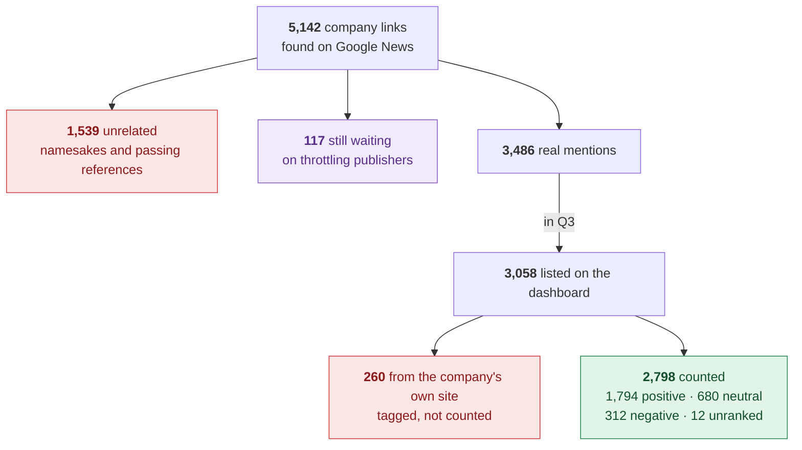
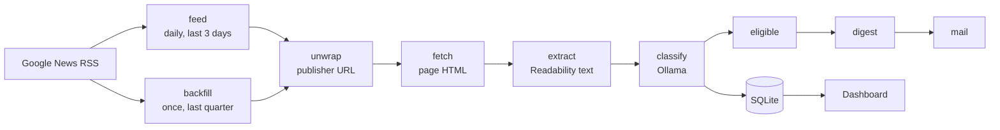
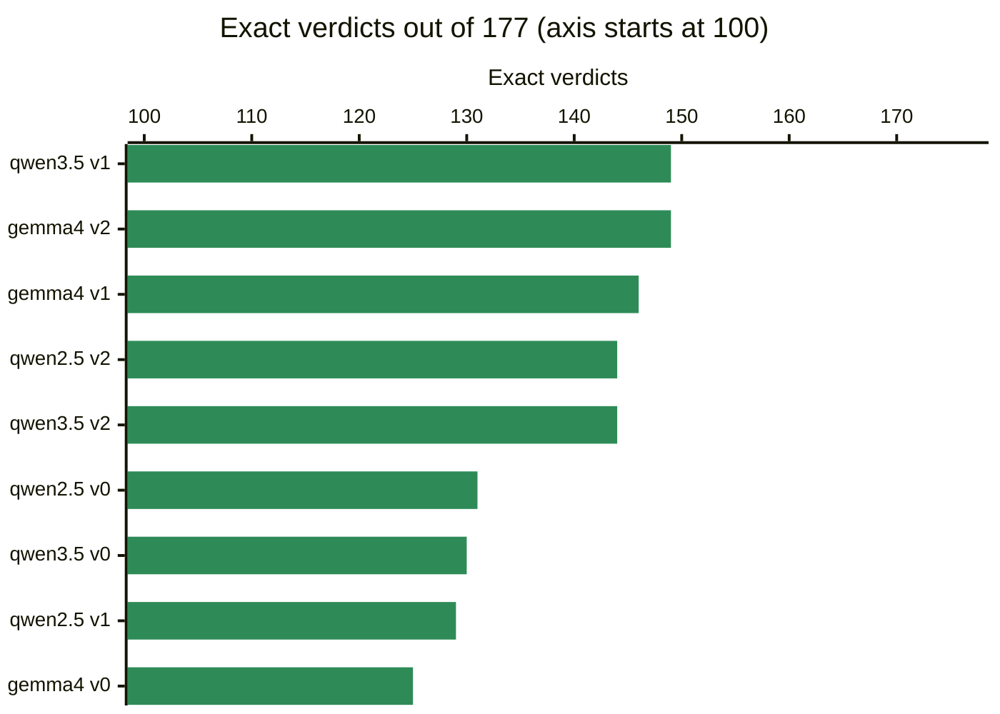
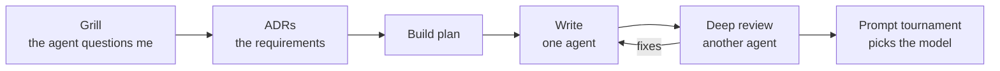

# Press Mentions Monitor

[](https://github.com/itayavtalyon/press-mentions/actions/workflows/verify.yml)


**Tracks press coverage for OurCrowd's 258 portfolio and fund companies.** It collects news, judges each article with a **local Ollama model**, shows the quarter on a dashboard, and a daily job alerts when new coverage appears.


> [!TIP]
> **See it without Ollama or Google.** The real run is committed in [`data/`](data/). Browse it in the dashboard:
>
> ```bash
> npm ci && cp .env.example .env
> COVERAGE_DB=data/sqlite/coverage.sqlite ALERTS_DB=data/sqlite/alerts.sqlite npm start   # http://127.0.0.1:3000
> ```

## At a glance

| The assignment asks for                         | Where it is                                                                                 | Proof from the real run                                                                |
| ----------------------------------------------- | ------------------------------------------------------------------------------------------- | -------------------------------------------------------------------------------------- |
| **Quarterly dashboard**, each mention linked    | `npm start`: index of every company, a page per company                                     | 2,798 Q3 mentions counted, each linked to its source                                   |
| **Mention status**, "last mentioned 3 days ago" | The index's _Last mentioned_ column, each company page, [`summary.json`](data/summary.json) | 79 companies within a week · 34 in 8–30 days · 40 earlier · 105 with none found        |
| **Daily alert** on new coverage                 | `job:feed` → … → `job:mail` from cron, one digest per company                               | 4 Oct: 510 new links → 304 mentions → **45 digests sent** ([outbox](data/alerts.json)) |
| **Local LLM**, why and how                      | [The local LLM](#the-local-llm)                                                             | Chosen by a 9-pair tournament; human spot-check 24 / 30 right                          |
| **Data folder** of a real run                   | [`data/`](data/), explained in [`data/README.md`](data/README.md)                           | JSON per company, the status file, the outbox, and the three databases                 |
| **The prompts** given to AI assistants          | [`PROMPTS.md`](PROMPTS.md)                                                                  | Every prompt, in order                                                                 |

## The run in one picture

Q3 2026 (1 Jul – 30 Sep, UTC), from the backfill and the first daily run on 4 Oct:



The LLM's `unrelated` verdict is what keeps _Astra_ the rocket company apart from every other Astra. Own-site posts are Databricks' blog, CarDekho's car reviews, and the like: the company talking about itself, not press.

## The dashboard

**Simple.** Two pages and one filter bar. The index lists every company with its last mention in words ("3 days ago", "No coverage") and its quarter's tone. A company page charts the quarter week by week, then lists each mention, negative first, linked to the publisher. Each mention is marked when its verdict came from the headline only, or when the company published it itself.

**Fast.** Plain server-rendered HTML. No framework, no build step, no chart library: the charts are inline SVG drawn on the server. The 258-company index renders in about 30 ms and a company page in about 20 ms. The whole browser script is 18 KB and only adds the name filter and the subscribe dialog. With JavaScript off, every page still works.

**Accessible.** WCAG 2.2 AA, with 0 axe violations on 13 pages, light and dark, at desktop and phone widths. Color never carries meaning alone: every verdict is a dot and a word, and every chart sits beside its counts in text. Keyboard, VoiceOver, forced colors, and 320 px reflow are all checked ([results](docs/RUNBOOK.md#dashboard-ui-checks)).

| The quarter, week by week                                                       | Tone at a glance                                                                    |
| ------------------------------------------------------------------------------- | ----------------------------------------------------------------------------------- |
|  |  |
| **A company's own posts are tagged, not counted**                               | **On a phone, in dark mode**                                                        |
|   |           |

<details>
<summary>More screens: self-promotion removed, negative first, disambiguation, email alerts</summary>

| Databricks without its own blog posts                                             | Negative coverage surfaces first                                  |
| --------------------------------------------------------------------------------- | ----------------------------------------------------------------- |
|  |           |
| **A namesake-prone company, mixed tone**                                          | **Email alerts per company**                                      |
|                              |  |

Every shot is the committed run, captured on 5 Oct. The full set, including forced colors and keyboard focus, is in [`docs/shots/`](docs/shots/).

</details>

## How it works



- **Source: Google News RSS.** Free, no key, worldwide publishers. Each link is **unwrapped** from Google's redirect to the publisher's URL ([how](docs/unwrap/README.md)), fetched, and run through Readability for the full text.
- **The queue is the database row.** Each article has a `stage`. Every step is its own cron command that drains its stage, holds its own lock, and exits. A crash loses nothing; a re-run resumes.
- **The backfill never alerts.** Only `daily` rows from the last 72 hours can become alerts, and the outbox is idempotent, so a re-run never sends a digest twice.

## The local LLM

**`qwen3.5:9b`, picked by a tournament rather than by taste.** `npm run job:eval` scores every installed model against every prompt version on a hand-labelled set of 177 decisions:



| Model / prompt           | Exact verdict     | Relevance right   | Sec / article (M1, 32 GB) |
| ------------------------ | ----------------- | ----------------- | ------------------------- |
| **qwen3.5:9b / v001** ✅ | **149/177 (84%)** | **164/177 (93%)** | **1.8**                   |
| gemma4:12b / v002        | 149/177 (84%)     | 161/177 (91%)     | 3.1                       |

The two leaders tie on exact verdicts. Relevance breaks the tie for Qwen, which is also 40% faster ([full results](docs/prompt-eval/README.md)).

**How it's invoked:** one call per article, judging every company the article was found for.

- **Prompt** ([`classifier.v001.txt`](prompt/classifier.v001.txt)): the article text (up to 6,000 characters), the publisher, and the candidate companies. A namesake-prone company gets a one-line identity, e.g. _"Astra — space launch company…"_.
- **Output**, constrained by Ollama's `format` JSON schema: `{"<company>": "positive" | "negative" | "neutral" | "unranked" | "unrelated" | "uncertain"}`, at `temperature: 0`, `seed: 0`, `think: false`.
- **Relevance and tone in one pass.** `unrelated` drops namesakes and passing references. `unranked` means it is about the company, but too thin to judge.
- **Fails closed.** A reply that won't parse becomes `uncertain`, is hidden from the counts, and is listed on the _Review_ page with the raw reply ([ADR 0002](docs/adr/0002-verdicts-and-fail-closed.md)). Thanks to the schema, none of the ~5,000 real calls needed it.

**How quality was validated:** the tournament set is 167 **real articles the system fetched**, graded easy / medium / hard, with namesakes and list mentions as the hard ones. A **human spot-check** of 30 random Q3 verdicts found **24 right, 4 debatable, 2 wrong**, with no namesake mix-ups ([graded list](docs/spot-check.md)).

## Run it end to end

**Prerequisites:** Node.js 24 and [Ollama](https://ollama.com/download).

```bash
npm ci
cp .env.example .env
ollama serve                 # skip if the Ollama app is already running
ollama pull qwen3.5:9b       # ~6.6 GB

npm run job:backfill         # Google News, 1 Jul → now, all 258 companies
npm run job:unwrap && npm run job:fetch && npm run job:extract && npm run job:classify
npm start                    # http://127.0.0.1:3000
```

The first run takes a few hours on an M1 with 32 GB. After that, the daily job is the same commands from cron. `job:mail` prints each digest as a `mail.sent` log line. `npm run job:export` rewrites `data/`, and `npm run verify` runs every quality gate.

<details>
<summary>The crontab and the environment variables</summary>

Each command drains its queue and exits. Per-command locks block overlapping runs.

```cron
0  6 * * *    cd /path/to/repo && npm run job:feed
*/15 * * * *  cd /path/to/repo && npm run job:unwrap  && npm run job:fetch  && npm run job:extract
*/15 * * * *  cd /path/to/repo && npm run job:classify && npm run job:eligible
*/15 * * * *  cd /path/to/repo && npm run job:digest  && npm run job:mail
```

| `.env`                                   | Default                   |
| ---------------------------------------- | ------------------------- |
| `COVERAGE_DB` / `ALERTS_DB` / `EVAL_DB`  | `data/*.sqlite`           |
| `OLLAMA_HOST`                            | `http://127.0.0.1:11434`  |
| `ALERT_EMAIL`                            | `alerts@example.com`      |
| `GOOGLE_TOKEN_MS` / `PUBLISHER_TOKEN_MS` | 1000 / 2000 (rate limits) |
| `PORT`                                   | 3000                      |

`ALERT_EMAIL` is the default subscriber. Any company page also has a _Get email alerts_ form.

</details>

## Engineering

- **Robust:** every step resumes after a crash, and a row that fails 3 times is parked instead of retried forever. Google 429s get backoff, each publisher host has its own rate limit, and alert writes are transactional and idempotent.
- **Gated in CI:** strict ESLint (security rules included), Prettier, `tsc` over JSDoc types, **824 Vitest tests at 100% coverage**, knip, a duplication check, and `npm audit`. No test touches the network ([ADR 0009](docs/adr/0009-tests-without-network.md)).
- **Written down:** 9 ADRs in [`docs/adr/`](docs/adr/), plus [the architecture](docs/ARCHITECTURE.md) and [the runbook](docs/RUNBOOK.md).

<details>
<summary>Source layout</summary>

```
src/jobs     one entry per cron command, plus the prompt evaluator
src/core     domain logic: windows, verdicts, tallies, the classifier prompt and schema
src/infra    adapters: Google News, unwrap, fetch, Ollama, SQLite, locks
src/server   HTTP server: routes, cross-site guard, headers
src/ui       server-rendered pages, the small browser script, and the CSS
```

</details>

## Assumptions and limitations

- **"Last quarter" is the previous complete UTC calendar quarter** (Q3, 1 Jul – 30 Sep). With script on, times show in the viewer's zone.
- **Google News RSS is not an API.** It throttles, caps at about 150 articles per company per quarter, and the unwrap call is undocumented, so it could change.
- **28% of articles were judged from the headline alone,** because their publishers block bots or paywall the page. The dashboard marks them. 117 links wait on throttling publishers for the next run.
- **Disambiguation:** 57 namesake-prone companies have a descriptor in [`seed/overlay.json`](seed/overlay.json), drafted with AI and reviewed by hand. The rest rely on the LLM's `unrelated`.
- **A company's own site** is matched by its domain name, or by the overlay's `website` when the name differs.
- **Alerts go to the console log** through an outbox that a real mail adapter can drain unchanged. The dashboard has no auth and binds to 127.0.0.1. Everything is SQLite on one machine, which suits this scale.

## Taking it further

**Product**

| Idea                       | Why                                                                                                               |
| -------------------------- | ----------------------------------------------------------------------------------------------------------------- |
| **Negative-spike alerts**  | The weekly buckets already exist. Alert when a company's negative share jumps, not only when any mention appears. |
| **Slack or Teams digest**  | A second adapter on the same outbox, where the portfolio team already works.                                      |
| **One-line summaries**     | The local model writes "why this matters" per mention, so a digest reads in seconds.                              |
| **Corrections that teach** | A fix on the _Review_ page becomes a labelled case, and the tournament re-runs on it.                             |
| **Portfolio view**         | Roll tone up by sector or fund, once the seed carries those fields.                                               |

**Scale**

| Now                                         | Next                                                                      |
| ------------------------------------------- | ------------------------------------------------------------------------- |
| Cron polls a SQLite `stage` column          | A queue (SQS, Kafka) triggers each step; fetch workers shard by publisher |
| An in-memory token bucket per process       | **Redis** as the one source of truth for rate limits across workers       |
| `fetch` + Readability; bot walls → headline | Headless-browser workers for the full text                                |
| Google News RSS                             | A paid news API (NewsAPI, GDELT, …) for wider coverage without throttling |
| Console "email"; SQLite                     | SES or Postmark behind the existing outbox; Postgres                      |

## How it was built



Built with **Claude Code, Grok Build, and Cursor**, steered by a written spec. My own CLI, **Remember**, kept state and workflows in sync across the agents.

1. **ADRs written by grilling.** The agent questioned me on every requirement; the answers became [ADRs](docs/adr/), which served as the product requirements.
2. **A plan from the ADRs** ([build plan](docs/BUILD-PLAN.md)), plus research and trial calls to pin down Google News' real unwrap API.
3. **One agent writes, a different one reviews.** Every component passed a deep review, with [coding standards](docs/CODING-STANDARD.md) and strict CI gates as guardrails.
4. **The tournament** chose the model and prompt from data.

Every prompt given to the agents is in [`PROMPTS.md`](PROMPTS.md).
