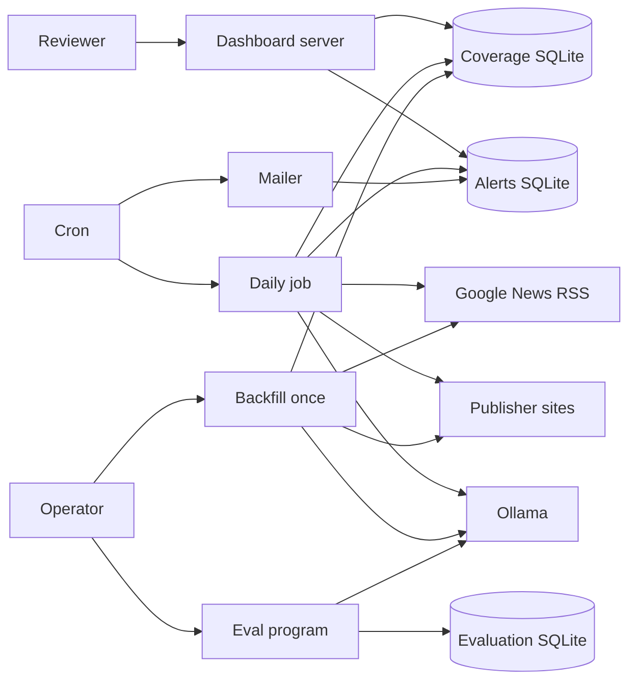
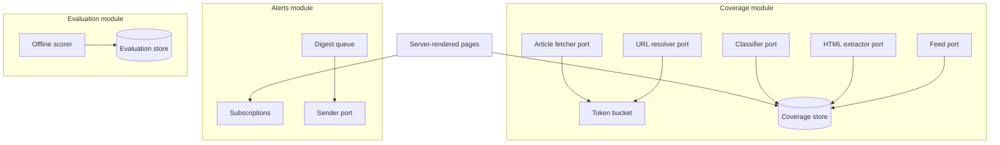
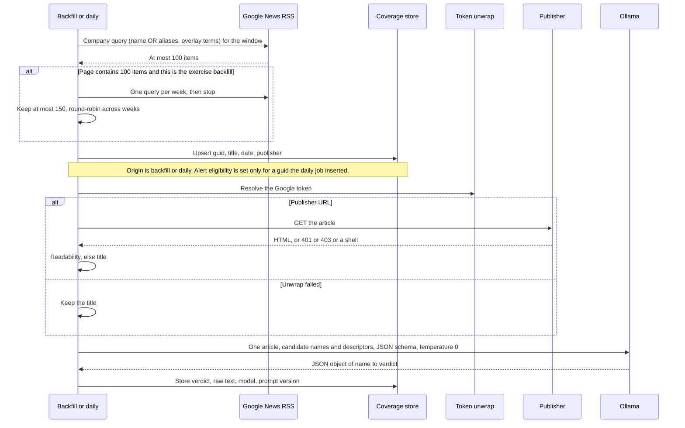
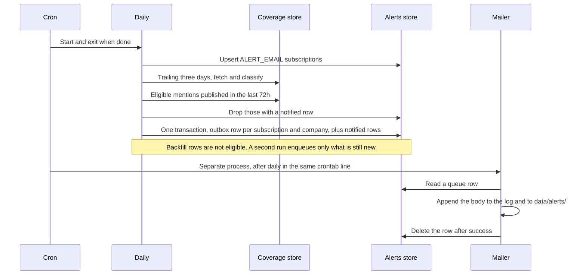
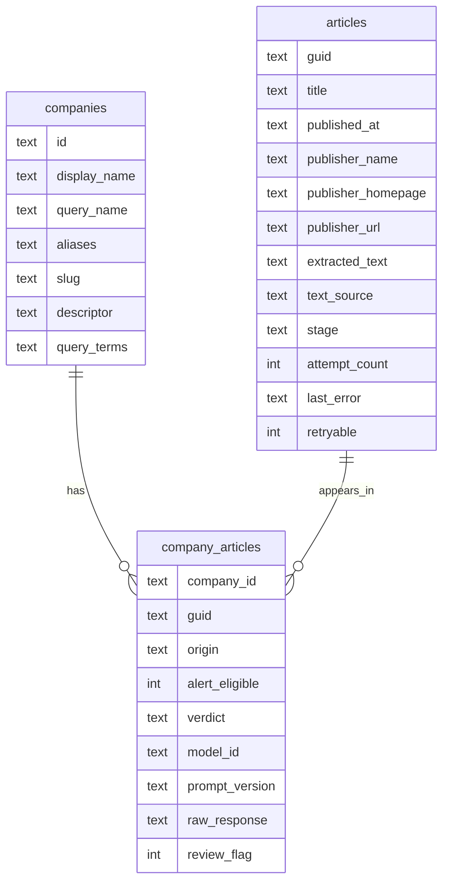
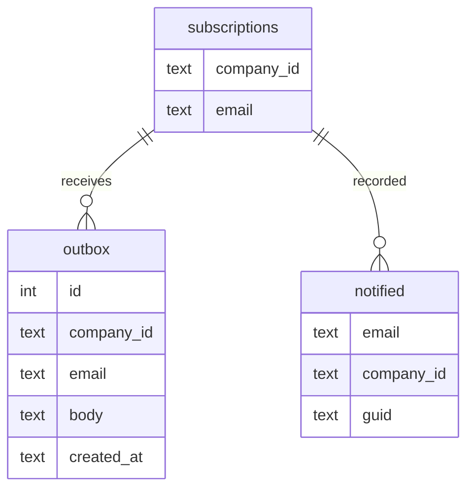
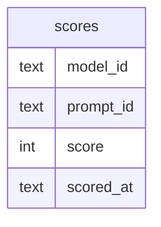
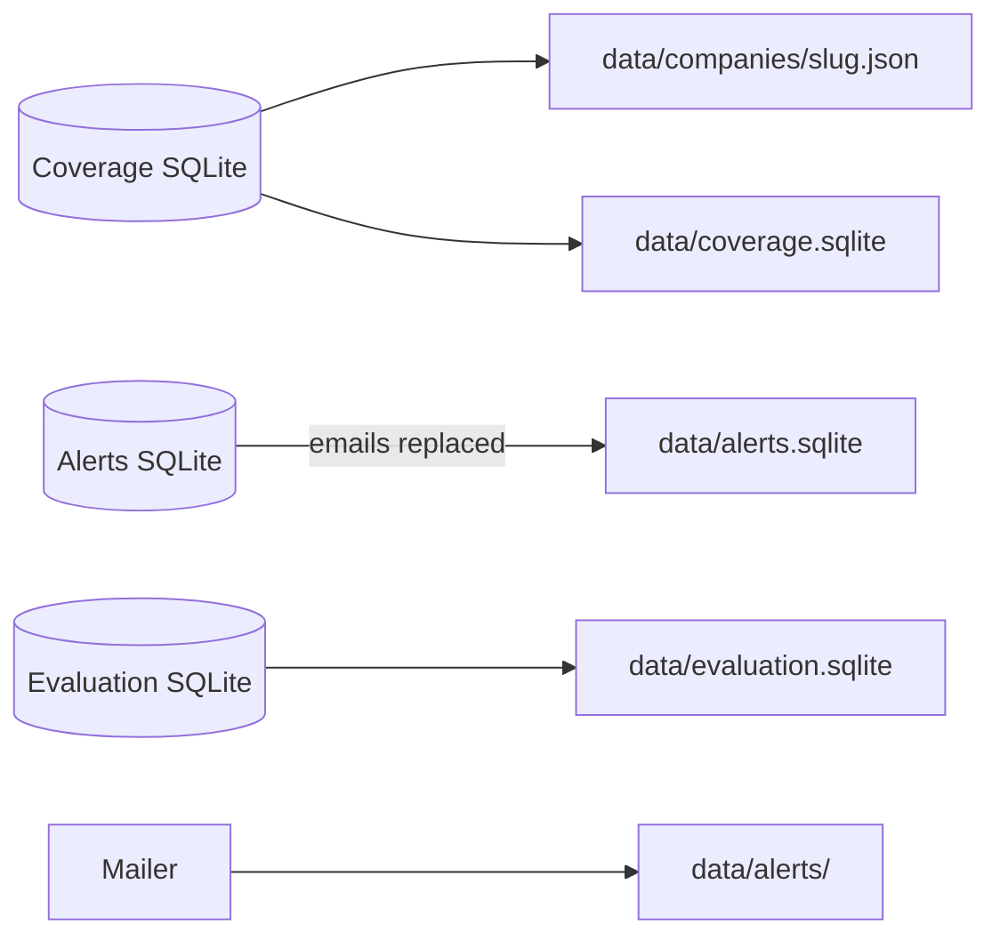

# Architecture

Press mentions for the OurCrowd seed list are collected from Google News RSS, judged by a local Ollama model, and shown on a small server-rendered dashboard. A one-time backfill fills the coverage store and does not notify anyone. A daily cron job collects forward, and a second cron job hands each subscribed company a digest of what that job newly found. Three SQLite files keep coverage, alerts, and prompt scores apart so the exercise process can later split along those lines. The live model and prompt are constants chosen offline. The main README is the runbook and the production/v2 narrative. This document is how the pieces move.

## Context

The exercise mailer writes the log and a file. Production notes in the README describe SMTP. Redis is described there as the shared rate-limit bucket and is not installed.

## Components

Exercise implementations are the Google News RSS adapter, the `batchexecute` unwrap, an HTTP fetcher, Mozilla Readability on linkedom, the Ollama client, an in-memory bucket, and a log-and-file sender. The orchestrator takes these as arguments. Pure functions, including day counts and the bucket math, are not behind a port.

## Collection and classification

The backfill window is last quarter through now. The daily window is the trailing three days. Each adapter handles its own failures (ADR 0006): Google and publisher throttles back off, honoring `Retry-After`. Ollama failures back off. 401, 403, 404, and shells take the title path at once. When backoff is exhausted, the item stays retryable and the run exits non-zero. A third failed run makes the item terminal. `uncertain` is not retried.

## Daily alert

Digest order is negative, positive, neutral, then `unranked`. No row is written when the company has no new eligible mention.

## Coverage store

`origin` is `backfill` or `daily`. `verdict` is `positive`, `negative`, `neutral`, `unranked`, `unrelated`, or `uncertain`.

## Alerts store

`subscriptions` is unique on company and email. `notified` is unique on email, company, and `guid`, and is written in the same transaction as the outbox row it belongs to.

## Evaluation store

## Flow into data/

Each JSON file has the company name, `last_mentioned_at` (the newest visible `published_at` across all stored data, or null), the export's `as_of`, and the visible mentions for the exported window: title, link, date, verdict, and text source. The "N days ago" sentence is rendered by the page, never stored. Hidden verdicts remain in `data/coverage.sqlite`. Copies use `db.backup()`. The export may be partial and fails loudly above 100 MB per file.

## Runtime and configuration

One OS process per command. Publishers on different hosts may proceed together. `news.google.com` and each publisher host take one token at a time. Defaults are one token per second for Google and one token per two seconds for anyone else, from environment variables so a polite run can go slower.

| Variable             | Role                                                                                |
| -------------------- | ----------------------------------------------------------------------------------- |
| `COVERAGE_DB`        | Coverage SQLite path                                                                |
| `ALERTS_DB`          | Alerts SQLite path                                                                  |
| `EVAL_DB`            | Evaluation SQLite path                                                              |
| `OLLAMA_HOST`        | Default `http://127.0.0.1:11434`                                                    |
| `PORT`               | Dashboard port                                                                      |
| `GOOGLE_TOKEN_MS`    | Refill interval for Google, default 1000                                            |
| `PUBLISHER_TOKEN_MS` | Refill interval for other hosts, default 2000                                       |
| `ALERT_EMAIL`        | Default subscriber for every company; `.env.example` ships an `example.com` address |

The model id, the prompt version, the backfill cap of 150, the 72-hour alert age gate, and the backoff limits are constants, not environment variables. The seed is the provided plain-text file, one name per line. Parentheticals become aliases. The overlay file adds descriptors and query terms (ADR 0003). Each job holds an exclusive lock file. Every connection uses WAL and `busy_timeout`.

Logging is structured enough to grep: company, `guid`, stage, and error. A 100-item feed is logged as truncated. Parse failures log the raw model text.

## Exercise and production

| Topic              | Exercise                                     | Production note                                     |
| ------------------ | -------------------------------------------- | --------------------------------------------------- |
| Backfill depth     | Quarter, then weeks, at most 150 per company | Keep halving, no cap. A full day is the RSS ceiling |
| Rate limit         | In-memory token bucket                       | Redis key shared by workers                         |
| Mail               | Log and file, then delete the row            | SMTP, then delete the row                           |
| Signup             | Dialog on the company page, no confirmation  | Confirm the address before SMTP                     |
| Egress             | One IP                                       | A pool of addresses, not specified here             |
| Historical quarter | One backfill so `data/` is populated         | Empty until a quarter of daily collection exists    |

## Where a decision lives

| Kind                                                   | Place                               |
| ------------------------------------------------------ | ----------------------------------- |
| One choice and the alternatives                        | `docs/adr/`                         |
| How the run fits together                              | This file                           |
| Setup, commands, model, prompt, limits, production, v2 | Main README, written as the runbook |
| What to build first                                    | `docs/BUILD-PLAN.md`                |

## ADR index

| ADR                                           | Title                              |
| --------------------------------------------- | ---------------------------------- |
| [0001](adr/0001-utc-quarter-windows.md)       | UTC quarter windows                |
| [0002](adr/0002-verdicts-and-fail-closed.md)  | Verdicts and fail closed           |
| [0003](adr/0003-google-news-rss.md)           | Google News RSS collection         |
| [0004](adr/0004-local-classification.md)      | Local classification               |
| [0005](adr/0005-three-stores-and-export.md)   | Three stores and the graded export |
| [0006](adr/0006-ports-resume-and-retries.md)  | Ports, resume, and retries         |
| [0007](adr/0007-alerts-and-schedule.md)       | Alerts and schedule                |
| [0008](adr/0008-server-rendered-dashboard.md) | Server-rendered dashboard          |
| [0009](adr/0009-tests-without-network.md)     | Tests without network              |

## Open questions and risks

- Which installed model wins is unknown until the labeled set is scored. The constants stay unset until that run.
- Seconds per article on this M1 are unknown. With the cap, the estimate is about 6k capped candidates plus the long tail, roughly one night at 5 s each. Measure seconds per article during eval, and start the real backfill no later than Oct 3.
- Every candidate is unwrapped (two Google requests) and fetched. At about 8k+ candidates, that is several hours of Google traffic from one IP, and a block is plausible. A block backs off and leaves rows retryable. It does not bypass anything.
- `batchexecute` is unofficial. When it breaks, new rows fall back to the title and the README should say the unwrap failed.
- A week that returns 100 items is silently incomplete, and the cap samples it further. The dashboard does not mark sampled companies. The README does.
- Many business pages return 401, 403, or a script shell. Those mentions are title judgments, and `text_source` shows it.
- The overlay decides precision for about 30 ordinary-word names. A wrong or missing descriptor is a silent precision loss. The labeled set should include one hit and one miss for several of those names, not only Harvey.
- The mailer can send the same body twice if it crashes after a successful handoff and before the delete.
- A mention classified more than 72 hours after publication never alerts.
- Article text is committed in `data/coverage.sqlite`. Size is the only check.
- The subscribe form accepts any well-formed address. The exercise sender does not deliver mail. SMTP without a confirmation step would.
- The coverage gate is 100%. Error branches have to be driven through fakes, or the gate becomes a pile of empty assertions. The promise list in ADR 0009 is the review checklist. Entry-point shims are excluded by name, so they must stay free of logic (ADR 0009).
- Backoff limits (attempts, maximum delay) are still unset numbers. Three consecutive exhaustions stop the dependent stage (ADR 0006), so a lasting block costs at most three full backoffs.
- The seed has 258 names. Twelve carry a parenthetical: ten `(formerly X)` or `(formerly known as X)`, plus `Lambda (lambda.ai)` and `SSI (Safe Superintelligence)`. All twelve become aliases. The overlay replaces the ones that are ordinary words (Edge, Trellis).
